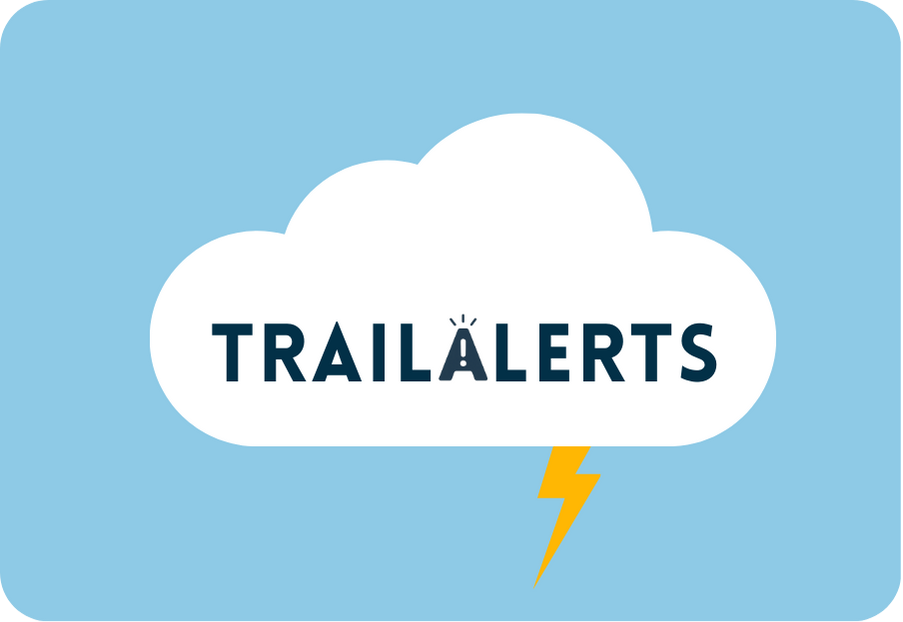
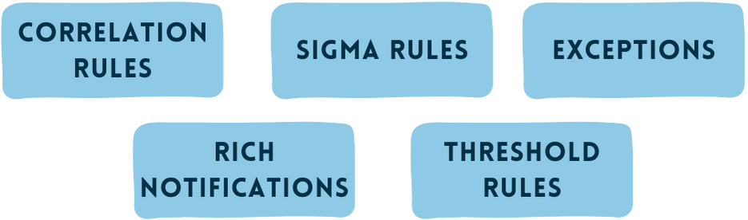
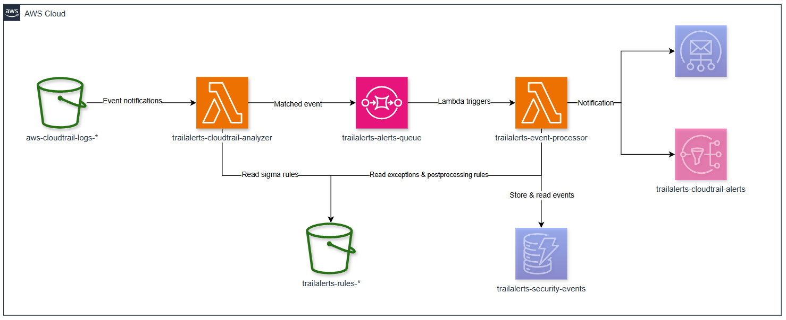
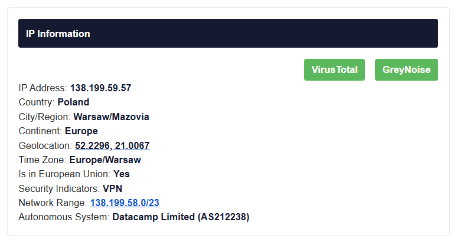

<p align="center">
  
</p>
<p align="center">
  
</p>

# TrailAlerts

TrailAlerts is a **AWS-native, serverless cloud-detection tool (not a SIEM)** that lets you define simple rules (written in open Sigma syntax) as code and get rich alerts about events in AWS.

It is aimed at people/companies who do **not** need a SIEM but still want ownership of their detections and find CloudWatch or EventBridge rules hard to manage.

* **Sigma rules:** Drop in community Sigma rules or write your own and version-control them with the rest of your infrastructure.
* **Total control of the alerting pipeline:** Decide exactly what you want to see, correlate related events, and publish notifications via SNS or SES.
* **All-serverless:** Built on Lambda, S3, SQS and DynamoDB, so you pay only for what you actually run.

## Motivation

While developing [TrailDiscover](https://traildiscover.cloud/) I confirmed my initial hunch: attackers repeat the same techniques and target the same AWS services, meaning a small set of good detections can catch many real-world attacks.

Current scenario seems to be as following:

* **Big enterprises** usually ship CloudTrail to a SIEM and create custom alerting there.  
* **Smaller organisations and personal accounts** turn on GuardDuty and hope for the best.

GuardDuty is excellent and I recommend keeping it enabled, but I wanted finer control over alerts.  
After testing the native options (which I wrote up in “[DIY — Evaluating AWS Native Approaches for Detecting Suspicious API Calls](https://medium.com/p/c6e05de97a49)”) I found CloudWatch and EventBridge rules difficult to manage and limited in correlation logic.

TrailAlerts fills that gap: the power to write your own rules without the cost or complexity of a SIEM, and without the pain of hand-crafting CloudWatch or EventBridge patterns.

## Table of Contents

- [Overview](#overview)
- [Architecture](#architecture)
- [Technical Details](#technical-details)
  - [CloudTrail Analyzer Lambda](#cloudtrail-analyzer-lambda)
  - [Event Processor Lambda](#event-processor-lambda)
  - [Rules Structure](#rules-structure)
    - [Exception Rules](#exception-rules)
    - [Post-Processing Rules](#post-processing-rules)
  - [Detection Rules](#detection-rules)
  - [Correlation Engine](#correlation-engine)
  - [Notification System](#notification-system)
- [Infrastructure](#infrastructure)
- [Setup and Deployment](#setup-and-deployment)
  - [Basic deployment steps](#basic-deployment-steps)
  - [Recommended deployment steps](#recommended-deployment-steps)
- [Enrichment](#enrichment)
- [Rule Compatibility](#rule-compatibility)
- [Cost Considerations](#cost-considerations)
- [Contributing](#contributing)

## Overview

TrailAlerts is designed to provide security monitoring for AWS environments by analyzing CloudTrail logs for suspicious or malicious activities. It leverages the open-source Sigma rules format to define detection patterns, allowing for easy customization and expansion of detection capabilities.

Key features:
- Almost real-time CloudTrail event monitoring (CloudTrail publishes log files multiple times an hour, about every 5 minutes.)
- Based on industry-standard Sigma rules format
- Event correlation for detecting attack patterns
- Customizable alerting thresholds and notification settings
- Serverless architecture for cost-efficiency and scalability
- Allow exeptions based on IPs or identity.
- Terraform-managed infrastructure

## Architecture

The system uses a serverless architecture built around AWS Lambda, SQS, DynamoDB, and other AWS services:



1. CloudTrail logs are stored in an S3 bucket
2. The CloudTrail Analyzer Lambda function processes new log files as they arrive
3. When a log event matches a Sigma rule, it's sent to an SQS queue
4. The Event Processor Lambda consumes messages from the queue
5. If correlation is enabled, events are stored in DynamoDB for pattern matching
6. If event matches the rules, alerts are sent via SNS or SES (SES recommended)

## Technical Details

### CloudTrail Analyzer Lambda

The CloudTrail Analyzer Lambda (`SigmaCloudTrailAnalyzer`) is triggered by S3 events when new CloudTrail logs are delivered. It:

1. Downloads and decompresses the CloudTrail log file
2. Fetches and parses Sigma rules from the rules S3 bucket (Uses caching mechanisms to optimize rule processing performance)
3. For each event in the log file, checks if it matches any Sigma rule
4. When matches are found, formats the alert data and sends it to SQS

The analyzer uses an efficient, two-stage approach:
- First pass: Fast filtering of events by eventSource and eventName
- Second pass: Detailed rule evaluation with full pattern matching

The Lambda implements a caching system that limits S3 list operations to at most once every 5 minutes, optimizing performance and reducing API call costs when frequently invoked.

### Event Processor Lambda

The Event Processor Lambda (`SigmaEventProcessor`) handles events from the SQS queue and:

1. Extracts data from the event
2. Check if the event should be excluded based on exception rules
3. If DynamoDB is enabled it:
    - Implements cooldown periods to prevent alert flooding
    - Checks correlation
    - Checks alert threshold 
4. Checks alert severity against notification thresholds
5. Formats and sends notifications via SNS or SES

Key modules in the Event Processor:
- `lambda_function.py`: Main handler and orchestration
- `cloudtrail_helpers.py`: Functions for processing CloudTrail event data
- `correlation_helpers.py`: Implements event correlation logic
- `dynamodb_helpers.py`: Functions for interacting with DynamoDB for storage
- `email_helpers.py`: Email notification formatting and delivery
- `ip_helpers.py`: IP address validation and enrichment
- `notification_helpers.py`: General notification handling
- `threshold_helpers.py`: Alert threshold management
- `utils.py`: General utility functions
- `styles.py`: HTML email styling
- `constants.py`: Configuration constants
- `exception_helpers.py`: Exception handling and management

### Rules Structure

The system organizes detection rules in the following structure within the S3 bucket:

```
rules/
├── sigma_rules/           # Contains Sigma YAML rule definitions
│   ├── aws_cloudtrail_disable_logging.yml
│   ├── aws_console_login_without_mfa.yml
│   └── ...
├── exception.json         # Exception rules for filtering out benign events
└── postprocessing_rules/  # Contains post-processing rules
    ├── correlation_iam.json  # Correlation rules focused on IAM
    ├── correlation_s3.json   # Correlation rules focused on S3 operations
    ├── thresholds.json       # Threshold rules for various alerts
    └── ...
```

#### Exception Rules

Exception rules (defined in `exception.json`) allow you to suppress alerts based on specific criteria such as source IP addresses or user identities. These exceptions prevent notification fatigue from known legitimate activities.

Example `exception.json` structure:
```json
{
    "AWS SecretsManager GetSecretValue": {
        "excludedActors": ["arn:aws:iam::123456789012:user/ci-bot", "arn:aws:iam::123456789012:role/app-sync"],
        "excludedSourceIPs": ["10.0.1.100"],
        "excludedActorsRegex": ["^AWSReservedSSO_AdministratorAccess.*"]
    },
    "AWS Console Login": {
        "excludedActors": ["arn:aws:iam::123456789012:user/monitoring"]
    }
}
```

Each exception rule uses the Sigma rule title as the key and can include:
- `excludedActors`: List of ARNs for IAM users or roles to exclude
- `excludedSourceIPs`: List of IP addresses to exclude
- `excludedActorsRegex`: List of regex patterns to match and exclude IAM entities

#### Post-Processing Rules

Post-processing rules (stored as JSON files in the `postprocessing_rules/` directory) allow you to define additional processing logic that happens after matching events against Sigma rules. The lambda can process multiple JSON files in this directory, each focusing on different types of rules or different AWS services.

You can organize post-processing rules into multiple files for better management. For example:
- `correlation_iam.json` for IAM-related correlation rules
- `correlation_s3.json` for S3-related correlation rules
- `thresholds.json` for threshold rules

The system supports two types of post-processing rules:

##### 1. Correlation Rules:
Correlation rules detect relationships between different alert types within a specified time window.

```json
[
  {
    "type": "correlation",
    "sigmaRuleTitle": "AWS CloudTrail Attach Policy",
    "lookFor": "AWS CloudTrail IAM User Creation",
    "windowMinutes": 15,
    "severity_adjustment": "high",
    "description": "User creation followed by policy attachment"
  }
]
```

Each correlation rule includes:
- `type`: Must be "correlation"
- `sigmaRuleTitle`: The title of the triggering Sigma rule
- `lookFor`: The title of another Sigma rule to correlate with
- `windowMinutes`: Time window for correlation
- `severity_adjustment`: How to adjust severity when correlation is found
- `description`: Description of the correlation pattern

##### 2. Threshold Rules:
Threshold rules detect when the same alert occurs multiple times within a time window.

```json
[
  {
    "type": "threshold",
    "sigmaRuleTitle": "AWS SecretsManager GetSecretValue",
    "thresholdCount": 10,
    "windowMinutes": 5,
    "severity_adjustment": "medium",
    "description": "Multiple SecretsManager accesses by same actor in short time window"
  }
]
```

Each threshold rule includes:
- `type`: Must be "threshold"
- `sigmaRuleTitle`: The title of the Sigma rule to monitor
- `thresholdCount`: Number of occurrences needed to trigger
- `windowMinutes`: Time window for counting occurrences
- `severity_adjustment`: How to adjust severity when threshold is exceeded
- `description`: Description of the threshold alert

You can add multiple rule files to the post-processing directory, and the Lambda will automatically load and process all JSON files found there, making the system highly extensible and easy to organize.

### Detection Rules

The system uses Sigma rules stored in YAML format in the `/rules` directory. Each rule consists of:

- Title and description
- Tags and references
- Severity level
- Detection logic (conditions to match in CloudTrail events)
- Potential false positive scenarios

Example rule structure:
```yaml
title: AWS Security Group Change
id: 123456-abcd-1234-5678-1234567890ab
status: test
description: Detects changes to security groups
references:
    - https://example.com/reference
author: Security Team
date: 2023-01-01
tags:
    - attack.impact
    - attack.t1123
logsource:
    product: aws
    service: cloudtrail
detection:
    selection_source:
        eventSource: ec2.amazonaws.com
        eventName: 
          - AuthorizeSecurityGroupIngress
          - AuthorizeSecurityGroupEgress
    condition: selection_source
falsepositives:
    - Legitimate security group changes
level: medium
```

Each rule has a corresponding test file (`*_tests.json`) that contains test cases to validate the rule.

### Correlation Engine

When enabled, the correlation engine stores alerts in DynamoDB with TTL-based expiration. It can detect:

1. Frequency-based patterns (multiple occurrences of the same event type)
2. Sequence-based patterns (specific events in a particular order)

Correlation adds context to alerts by showing related events, making it easier to identify more sophisticated attack patterns such as privilege escalation chains or multi-stage attacks.

### Notification System

The notification system supports:

1. Email alerts
2. SNS topic for simple configurations
3. Severity-based filtering (only alert on certain severity levels)
4. Cooldown periods to prevent alert fatigue
5. Rich HTML emails with event details, resources affected, and context

## Infrastructure

The infrastructure is defined using Terraform in the `/terraform` directory. Key components include:

- Lambda functions with appropriate IAM roles and permissions
- SQS queue for alevents message handling
- S3 bucket for Sigma rules (optionally for Cloudtrail)
- DynamoDB table for event correlation (optional)
- CloudWatch Log groups for Lambda logging
- SNS topics for notifications (optional)

Infrastructure is parameterized through Terraform variables in `terraform.tfvars.json`, allowing for easy customization of:

- Email source and destination
- Notification settings
- Cloudwatch logs Retention periods
- Security thresholds
- Correlation options

## Setup and Deployment

Prerequisites:
- AWS account with appropriate permissions
- Terraform installed
- AWS CLI configured
- Recommended: Organizational CloudTrail with multiregion

### Basic deployment steps:

1. Clone the repository
2. Configure `terraform/terraform.tfvars.json` with your settings
3. Access the terraform folder `cd terraform`
4. Initialize Terraform: `terraform init`
5. Deploy: `terraform apply` - Retry if there is a "Provider produced inconsistent final plan" error.
6. Upload Sigma rules to the created S3 bucket. Example: `aws s3 cp rules/sigma_rules/aws_cloudtrail_create_iam.yml s3://trailalerts-rules-{ACCOUNT_ID}/sigma_rules/`

### Recommended deployment steps:

The recommended deployment configuration follows GitOps practices, allowing you to manage both infrastructure and detection rules as code. This approach takes more time initially but provides better long-term maintainability and version control.

1. **Fork the repository**
   - Create your own fork of the TrailAlerts repository on GitHub

2. **Set up S3 backend for Terraform state**
   - Create an S3 bucket in your AWS account to store the Terraform state
   - Example bucket name: `your-org-terraform-state`
   - Enable versioning on the bucket for state recovery
  
3. **Set up GitHub to AWS authentication using OIDC**
   - Create an IAM OIDC provider for GitHub Actions in your AWS account
   - Create an IAM role with permissions to deploy resources and with a trust policy for your GitHub repository
   - utils/github_oidc.tf might be useful for this
  
4. **Configure GitHub repository secrets**
   - Add an `AWS_ACCOUNT_ID` secret with your AWS account ID
  
5. **Create a branch to modify the configuration**
   - Create a branch to apply the configuration from steps 6 and 7

6. **Configure Terraform backend**
   - Update `terraform/main.tf` with your S3 bucket configuration:
   ```hcl
    backend "s3" {
        bucket  = "trailalerts-terraform-state-556417283331" # Change this to your S3 bucket name
        key     = "terraform.tfstate"
        region  = "us-east-1"
        encrypt = true
    }
   ```

7. **Configure TrailAlerts settings**
   - Edit the file `terraform/terraform.tfvars.json`to match your environment (email preferences, notification settings, cloudtrail bucket, etc.)

9. **Enable GitHub Actions workflows**
   - Go to actions and enable the workflows

10. **Deploy the infrastructure**
   - Create a pull request. Make sure to do the pull request against you fork, not against the main TrailAlerts repository
   - Review the terraform plan
   - Merge the pull request to trigger the `deploy-trailalerts.yml` workflow
   - Rerun workflow in case of terraform provider error
   - This will deploy all TrailAlerts infrastructure components to your AWS account.

11. **Deploy or customize detection rules**
   - Customize rules in the `rules/` directory:
     - Modify existing Sigma rules or add new ones
     - Configure exception rules in `exception.json`
     - Create or update post-processing rules in `postprocessing_rules/`
   - Run the `deploy-rules.yml` workflow manually from the Actions tab to deploy your rules

11. **Monitor and maintain**
    - Review CloudWatch logs to ensure proper functioning
    - Update rules as needed and redeploy using the GitHub Actions workflow
    - For infrastructure changes, update Terraform files and use the deployment workflow

## Enrichment

### Enrichment

TrailAlerts supports basic alert enrichment to provide additional context for detected events. By integrating with external services, you can enhance the information included in alert notifications.

#### VPNAPI.io Integration

To enrich alerts with IP-related information, you can use the [VPNAPI.io](https://vpnapi.io/) service. This requires an API key, which can be added to the `terraform/terraform.tfvars.json` file using the `vpnapi_key` variable.

When the API key is configured, TrailAlerts will query VPNAPI.io for details about the source IP address associated with an event. The enriched data will be included in email notifications, providing insights such as:

- Whether the IP is associated with a VPN or proxy
- Geolocation details (e.g., country, city)
- ISP information



## Rule Compatibility

TrailAlerts supports a subset of the Sigma rule format, specifically optimized for CloudTrail logs. While not all Sigma features are supported, the system efficiently processes the most common patterns needed for CloudTrail security monitoring.

Compatible rule features:
- **Field exact matching**: Exact matching on fields like `eventSource: ec2.amazonaws.com`
- **List matching**: Match any value from a list, e.g., `eventName: ["AuthorizeSecurityGroupEgress", "AuthorizeSecurityGroupIngress"]`
- **Simple condition logic**: Rules can use basic conditions like `condition: selection` or `condition: 1 of selection_*`
- **Basic logical operations**: AND logic is implied when multiple fields are in the same selection block

The system uses a two-stage approach to efficiently process rules:
1. Fast initial filtering by `eventSource` and `eventName`
2. More detailed pattern matching on the filtered events

To see examples of compatible rules, examine the rules directory which contains over 50 pre-built rules with their associated test files. For instance, `aws_cloudtrail_disable_logging.yml` and its test file `aws_cloudtrail_disable_logging_tests.json`.

## Cost Considerations

TrailAlerts is designed to be cost-efficient through its serverless architecture, but there are several AWS costs to consider:

1. **Lambda Execution Costs**:
   - CloudTrail Analyzer Lambda: Invoked for each new CloudTrail log file
   - Event Processor Lambda: Triggered for each matching event
   - Costs scale with CloudTrail volume and rule match frequency

2. **Storage Costs**:
   - S3 storage for CloudTrail logs
   - DynamoDB storage for correlation data (if enabled)
   - CloudWatch Logs for Lambda function logs

3. **S3 Operation**:
   - Get log files from S3 and decrypt them
   - List and get rules from S3

4. **SQS and SNS**:
   - SQS message processing (modest for most deployments)
   - SES/SNS notifications (minimal)

Actual costs will vary based on CloudTrail volume, rule matching frequency, and AWS region pricing.

For an account with not much traffic costs should be under $10 month.

## Contributing

Contributions are welcome! Please feel free to submit a Pull Request.
